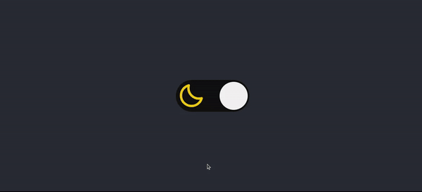

<h1 align="center"><b>Rocketseat Challenges</b></h1>

Challenges proposed by <a href="https://app.rocketseat.com.br/dashboard" target="_blank">Rocketseat</a>

<h2><a href="https://dkat-davi.github.io/Rocketseat-Challenges/challenges/theme-switcher" target="_blank">Theme Switcher</a></h2>

A webpage with a button to change the theme and the theme is saved in localStorage

    

